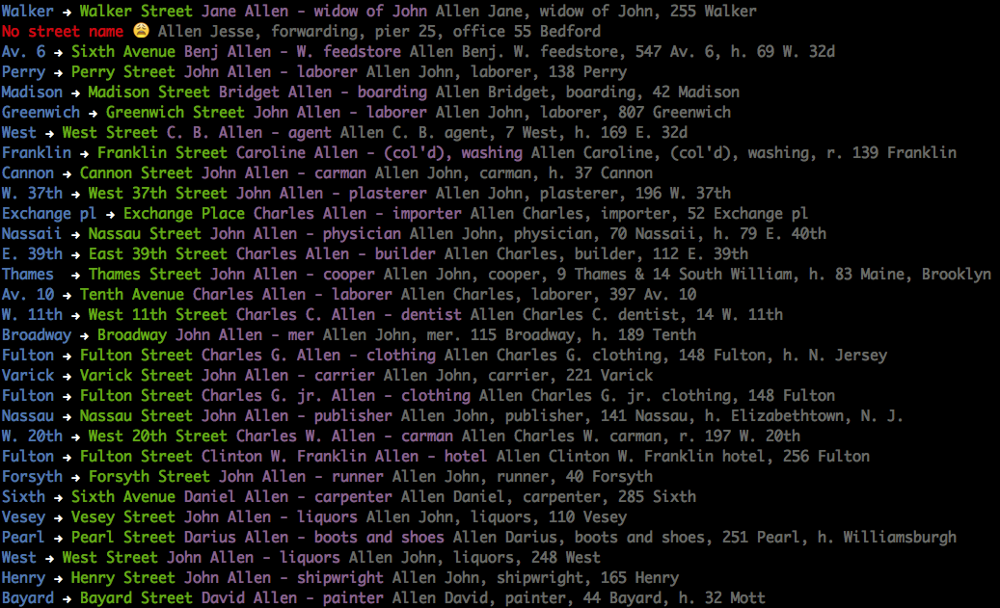

# Data / 1854 City Directory

Data module to convert OCR'ed 1854/55 Doggett's City Directory data to [Histograph NDJSON](https://github.com/nypl-spacetime/ontology). This data is being used to support work on the [NYC Space/Time Directory](http://spacetime.nypl.org) being developed by [NYPL Labs](http://labs.nypl.org).

Links to Doggett's City Directory images:

- http://digitalcollections.nypl.org/collections/new-york-city-directory-for-1854-1855-thirteenth-publication#/?tab=navigation
- https://archive.org/stream/doggettsnewyorkc1848dogg#page/n24/mode/1up

Maps and footprints depicting New York in 1854:

  - http://buildinginspector.nypl.org/
  - http://maps.nypl.org/warper/layers/861

  

### ~~~~ Last updated 2016-02-25 ~~~~

### License

Both scripts and data are CC0 - see [license](/LICENSE).
